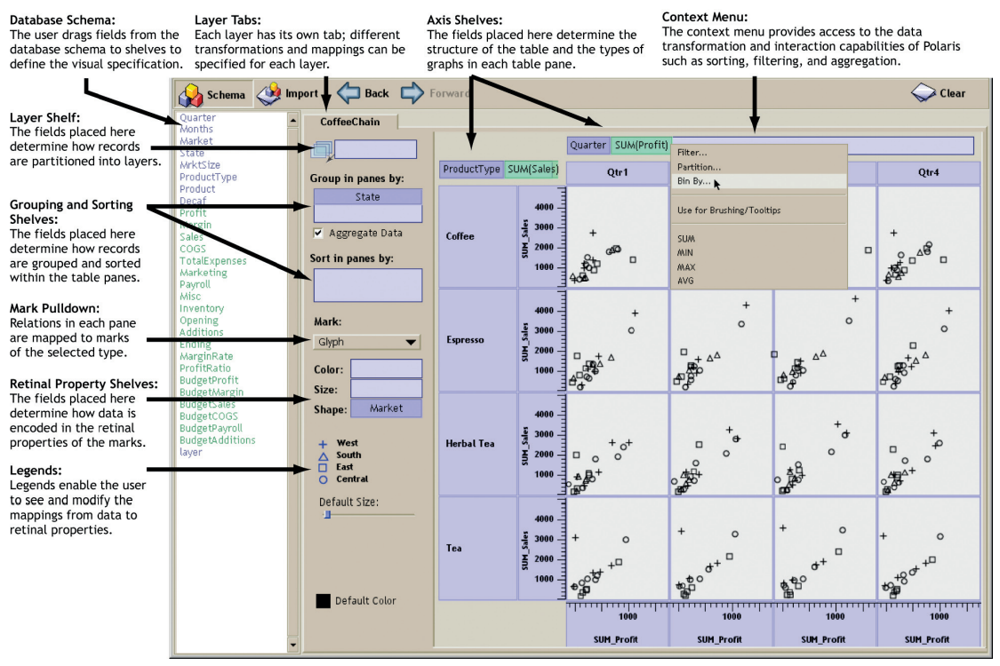

<link href="https://fonts.googleapis.com/css?family=Montserrat&display=swap" rel="stylesheet">

## Prezentacja projektu 2

1. Termin oddania: 20.05.2020, podczas wykładu zdalna prezentacja zespołu.
2. 19.05.2020 od 18:30 do 19:00 można przetestować prezentację na Google Meet. 

## Projekt 3

W ramach projektu 2 należy przygotować aplikację internetową, która pozwala testować wpływ rozmaitych błędów wizualizacyjnych na percepcję danych przedstawionych na wykresie. 
Aplikcja powinna zawierać przynajmniej **pięć** wykresów przedstawiających częste błędy wizualizacyjne (np. zbędny trzeci wymiar, wykresy kołowe) oraz pola w których użytkownik może zapisywać wartości odczytane z wykresu, a także możliwość przejścia w tryb sprawdzania, gdzie:
 
 - użytkownik porówna wprowadzone przez siebie wartości z rzeczywistymi,
 - użytkownik zobaczy porównanie poprawnego wykresu z niepoprawnym.

## Projekt 3

Projekty można realizować z osobami z innej grupy ćwiczeniowej w grupie do 5 osób. Za projekt 1 można otrzymać do 100 punktów z czego:

- 5 punktów za każdą prezentację postępów w projekcie podczas spotkania projektowego. Za każdą konsultację uznaje się przedyskutowanie z prowadzącym postępów w pracy nad projektem podczas spotkania projektowego.
- od 0 do 40 punktów za poprawność projektu (np. starannie wykonane wykresy).
od 0 do 25 punktów za dodatkowy wysiłek włożony w projekt (np. wyszukanie błędów wizualizacyjnych, które nie były wprowadzone na wykładzie).
- od 0 do 30 punktów za ciekawą prezentację projektu w postaci filmiku.

## Projekt 3

Termin oddania projektu: 10.06.2020, 14:00.

## BI

Business Intelligence software (przykłady):

 - Power BI,
 - Plotly,
 - **Tableau**.

## Polaris: twórcy

"Polaris, an interface for exploring large multi-dimensional databases that extends the well-known Pivot Table interface first popularized by Microsoft Excel."

http://www.graphics.stanford.edu/projects/polaris/

Źródło: *Polaris: a system for query, analysis, and visualization of multidimensional databases*, Proceeding IEEE InfoVis’00 reprinted Commun. ACM 51, 11 (November 2008), 75-84.

Twórcy:

 - Chris Stolte,
 - Diane Tang,
 - Pat Hanrahan.

## Założenie

1. Interfejs do eksploracji danych.
2. Zróżnicowane metody wizualizacji danych.
3. Wizualizacje o wysokiej wymiarowości i gęstości informacji. 

## Tabelaryczne ujęcie danych

## Tabelaryczne ujęcie danych

Zalety:

 - wielowymiarowość,
 - swojskość,
 - łatwość porównań (tabele generują wiele małych przedstawień informacji, które łatwo ze sobą porównywać w celu wskazania trendów/korelacji pomiędzy wymiarami).
 
## Tabelaryczne ujęcie danych

# Efektywne projektowanie dashboardów

## Rodzaje dashboardów

 - analityczne,
 - operacyjne.

Źródło: https://uxplanet.org/

## Analityczny dashboard

Źródło: https://uxplanet.org/

## Operacyjny dashboard

Źródło: https://uxplanet.org/

## Układ treści

Źródło: https://www.sisense.com/blog/4-design-principles-creating-better-dashboards/

## Właściwy dobór wizualizacji do danych

Źródło: https://www.tapclicks.com/the-ultimate-guide-to-data-visualization/.

